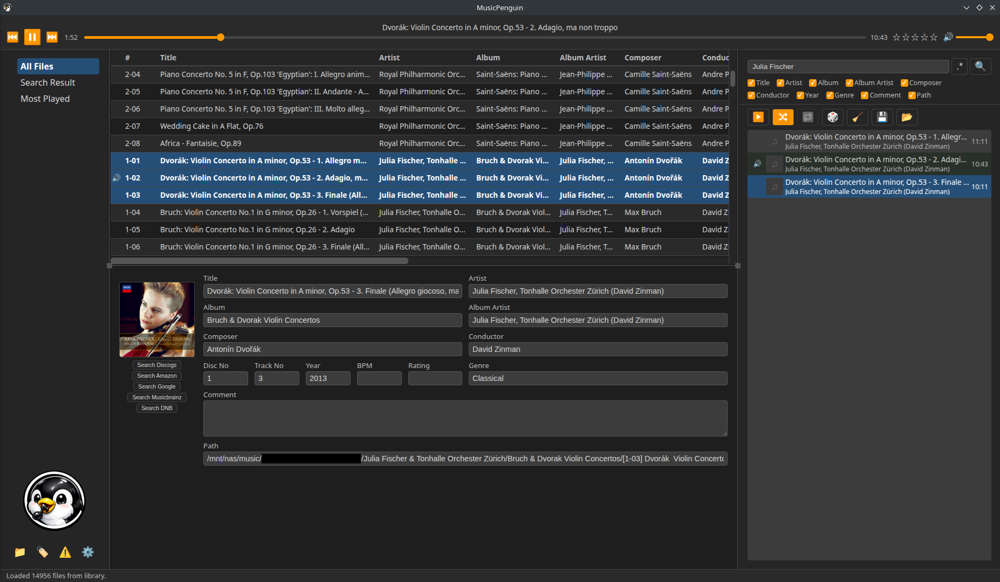

# MusicPenguin


* Homepage: <https://github.com/MinnieTheMoocher/MusicPenguin>
* Author:   <MinnieTheMoocher@users.noreply.github.com>

MusicPenguin is a fast local-first music library and player for Linux.

It is strongly inspired by [MusicBee](https://getmusicbee.com/forum/index.php?board=6.0)
by [Steven Mayall](https://getmusicbee.com/forum/index.php?action=profile;u=1),
a music player I have used and loved for many years.
MusicBee does run on Linux via Wine with some tricks, but there are always
some unsatisfying quirks remaining. Since a real Linux port has been out of
scope for many years now, I eventually decided to create MusicPenguin.
Consider the two to be friendly siblings

* MusicBee       <!-- cspell:disable-next-line -->
* MusicP(enguin) <!-- yes, the wordplay with MusicPee is funny, I KNOW THAT -->

MusicPenguin is implemented as an Electron desktop app.
It scans local folders (on your computer or an attached NAS)
for media files (audio and video),
reads their metadata tags in the background and stores them in a
local SQLite database for quick lookups. Your media collection
then is made browsable in a simple yet powerful UI that allows
quick searching, playlist creation and playback.
Built-in playback handles audio via `<audio>` HTML element; video files and other
formats can be opened in an external player (for example VLC).

This tool is aimed at people who prefer to keep their music independent
of online cloud storage and instead maintain their collection on local
machines or servers. You can browse your collection without having to
manually navigate through folders and files.

You can easily browse:

* all tracks by an artist
* all tracks of an album
* all tracks of a given year
* all tracks whose path contains a given substring
* and so on

All searches are case-independent tag or path substring searches,
and you can choose which properties of the media items to search.

## Screenshot



## License

MIT, see [LICENSE](./LICENSE)

## Install

Download the `*.deb` installation file of the release you want, then just run

```bash
sudo dpkg -i musicpenguin_0.0.1_amd64.deb
```

No node.js, npm, or separate Electron installation is necessary.

## Uninstall

```bash
sudo dpkg -r musicpenguin
```

## Building from Source Code

```bash
npm ci                  # install dependencies
npm run build           # run the build
npm run electron        # launch the app
```

## Known Issues / Planned Future Development

* cover art loading of playlist entries is ineffective sometimes, visible entries should load their covers first
* editing mp3 tags currently is not yet implemented but will be added soon
* play count and track rating currently is not yet persisted in the track files
* add drag+drop for media files or playlists
* support DLNA

## Implementation

see [IMPLEMENTATION.md](./IMPLEMENTATION.md)
