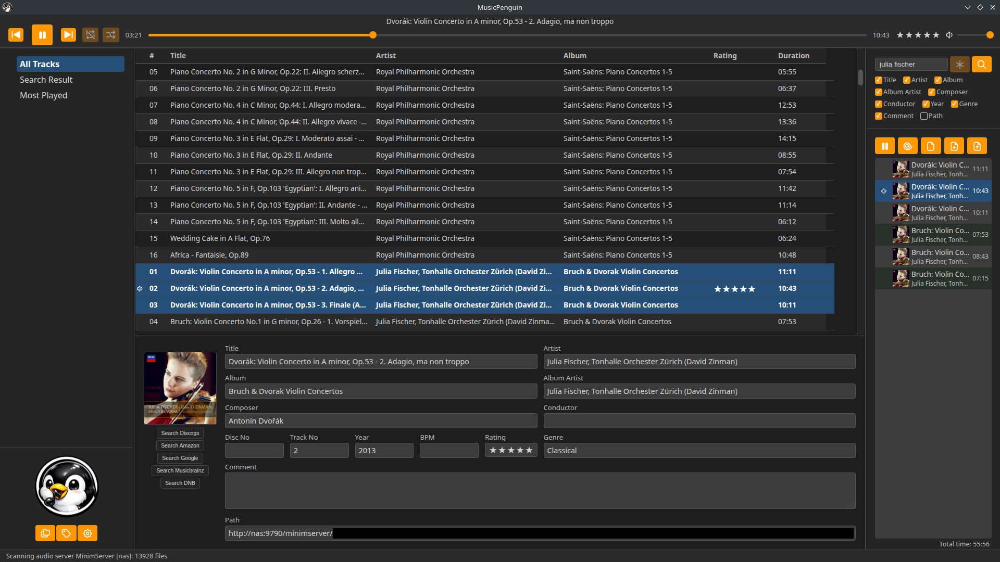
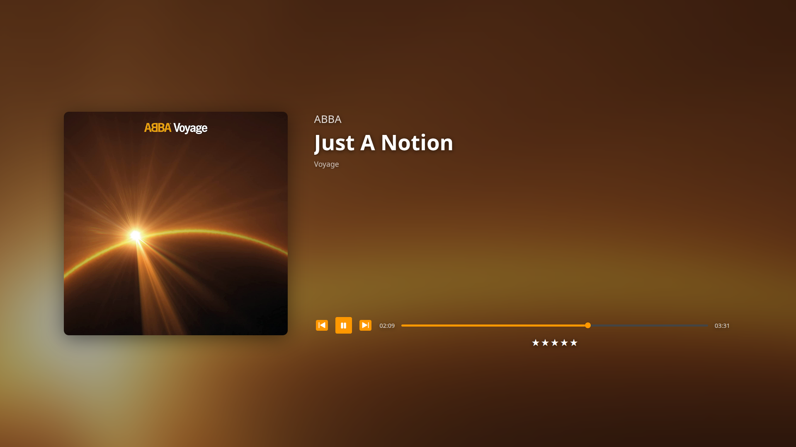
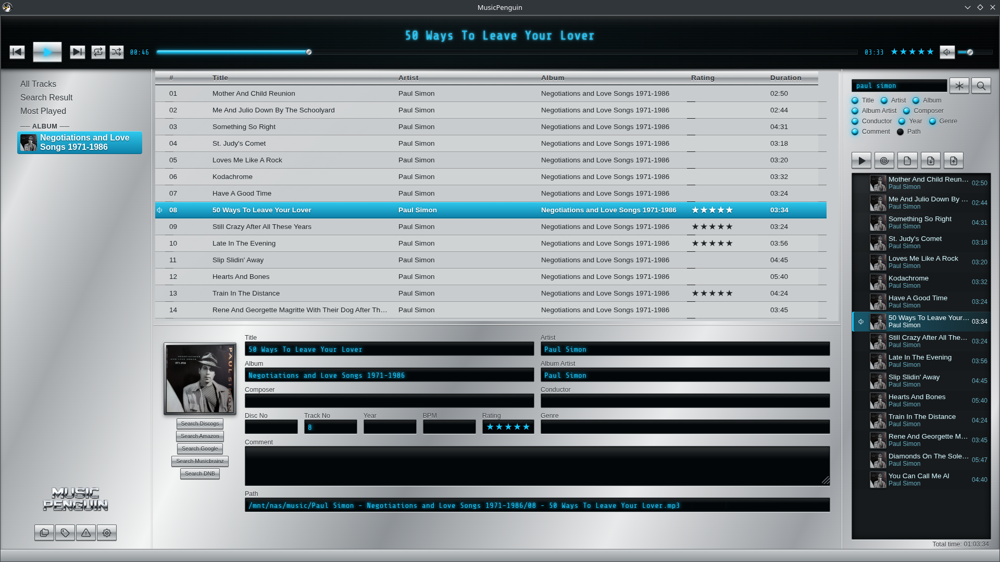
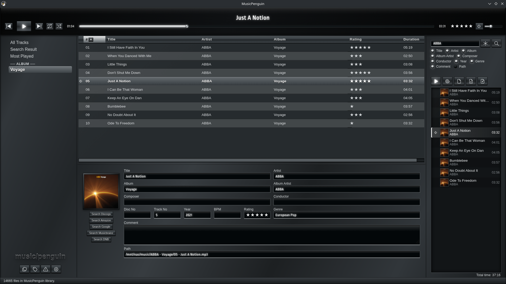

# MusicPenguin


* BlueSky: <https://bsky.app/profile/musicpenguin.bsky.social>
* GitHub:  <https://github.com/MinnieTheMoocher/MusicPenguin>
* Author:  <MusicPenguin@web.de>

MusicPenguin is a fast local-first music library and player for Linux.
This tool is aimed at people who prefer to keep their music independent
from online cloud storage, and instead prefer their collection on local
machines.

It is strongly inspired by [MusicBee](https://getmusicbee.com/forum/index.php?board=6.0)
by [Steven Mayall](https://getmusicbee.com/forum/index.php?action=profile;u=1),
a music player I have used and loved for many years.
MusicBee does run on Linux via Wine with some tricks; but there always remain
some unsatisfying quirks. Since a real Linux port of it has been out of
scope for many years now, I eventually decided to create MusicPenguin,
a friendly sibling

* MusicBee       <!-- cspell:disable-next-line -->
* MusicP(enguin) <!-- yes, the wordplay with MusicPee is funny, I KNOW THAT -->

You can select folders on your local computer or on a mounted network drive
(for example on a NAS) which MusicPenguin shall scan for audio tracks.
It also can use a local media server in your network (DLNA/UPnP). For example
on a Synology NAS: [Media Server](https://www.synology.com/dsm/packages/MediaServer)
or the much more capable [MinimServer](https://www.synology.com/dsm/packages/MinimServer).
The data about found audio files is stored in a local database
which then can be browsed and searched quickly. For example you can easily find

* all tracks by an artist
* all tracks of an album
* all tracks of a given composer
* all tracks whose path contains a given substring
* and so on

All searches are case-independent tag or path substring searches,
and you can choose which properties of the media items to search.

## Supported Languages

English, French, Spanish, German

## Screenshots

### Default Design: Dark Gray



### Fullscreen Theater Mode



### Design: 80s Stereo 01



### Design: 80s Stereo 02



## License

* MusicPenguin: MIT, see [LICENSE](./LICENSE)
* Tabler Icons: MIT, see [LICENSE](./src/renderer/icons/LICENSE.md)

## Install / Uninstall

### Debian, Ubuntu, Kubuntu, Linux Mint et.al. (*.deb)

The package is self-contained, no node.js, npm, or separate Electron installation is necessary. Just
[download the latest `*.deb` installation file](https://github.com/MinnieTheMoocher/MusicPenguin/releases).

* Install:   `sudo apt install ./musicpenguin_0.0.4_amd64.deb`
* Uninstall: `sudo apt remove musicpenguin`

### OpenSUSE, Fedora et.al. (*.rpm)

The package is self-contained, no node.js, npm, or separate Electron installation is necessary. Just
[download the latest `*.rpm` installation file](https://github.com/MinnieTheMoocher/MusicPenguin/releases).

* Install:   `sudo zypper install musicpenguin-0.0.4-1.x86_64.rpm`
* Uninstall: `sudo zypper remove musicpenguin`

## Building from Source Code

```bash
npm ci                  # install dependencies
npm run build           # run the build
npm run electron        # launch the app
```

## Known Issues / Planned Future Development

* editing mp3 tags currently is not yet implemented, but one of the most important future features
* the play count and rating of tracks currently is only stored in the MusicPenguin database
  and not yet written to the audio files

## Implementation

[IMPLEMENTATION.md](./IMPLEMENTATION.md)

## Changelog

[CHANGELOG.md](./CHANGELOG.md)
